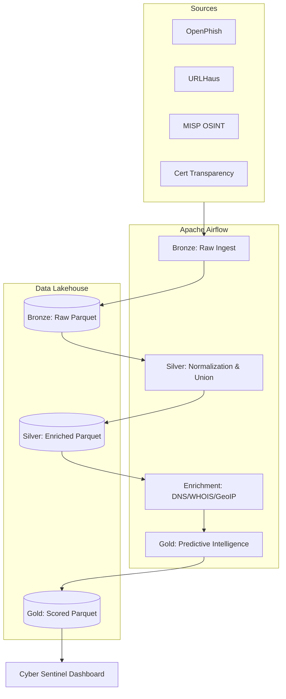

# Threat-Intel: Predictive Domain Intelligence Platform

An Airflow-orchestrated threat intelligence platform that automates the discovery, enrichment, and machine-learning-driven risk scoring of malicious domains in real-time.

## 🚀 Overview

This platform is designed to bridge the gap between reactive security lists and proactive threat hunting. Instead of just ingesting known-bad URLs, this system performs active reconnaissance (WHOIS/RDAP, DNS, GeoIP) and uses a LightGBM classifier to predict the risk level of newly seen infrastructure.

### Key Features
*   **Automated Ingestion**: Live stream processing of OpenPhish, URLHaus, and MISP OSINT feeds plus Cert Transparency logs.
*   **Infrastructure Recon**: Automated enrichment of domains via recursive DNS and RDAP protocols.
*   **Formal Medallion Architecture**: Production-grade data lakehouse structure (Bronze → Silver → Gold) implemented via Parquet and Airflow.
*   **Self-Driving ML Core**: Standardized production pipeline in `ml/core/` using LightGBM (98.8% ROC-AUC) and Logistic Regression.
*   **Premium "Cyber Sentinel" Dashboard**: High-fidelity Streamlit interface with glassmorphism aesthetics, interactive global risk maps, and deep-dive investigation modules.

---

## 🏗️ Architecture

The project follows a robust Data Engineering pattern to ensure reliability and scalability:



### Technical Stack
*   **Orchestration**: Apache Airflow 2.9.3 (Custom Docker Image)
*   **Data Processing**: Python (Pandas, PyArrow)
*   **Storage**: Partitioned Parquet (Medallion Layers)
*   **Machine Learning**: LightGBM, Scikit-Learn
*   **Visualization**: Streamlit, Plotly
*   **Environment**: Docker Compose

---

## 🛠️ Reliability & Senior Engineering Patterns

To handle the volatility of live internet data, the platform implements several advanced engineering patterns:
*   **Auto-Healing Retries**: All network-heavy tasks (WHOIS, DNS) implement double-retry policies with exponential backoff.
*   **Atomic Persistence**: All data writes use a temp-swap mechanism to ensure Parquet partitions are never corrupted.
*   **Production/Legacy Separation**: Standardized `ml/core` for production logic, isolating legacy artifacts to `ml/legacy`.

---

## 🛡️ Privacy & Ethical Considerations

This project is built with **Privacy-by-Design** principles:
1.  **Infrastructure Focus**: The platform targets server-side artifacts (IPs, Domains) rather than personal data.
2.  **Upstream Redaction**: Utilizing RDAP protocol over legacy WHOIS for automated registrant PII redaction.
3.  **Purpose Limitation**: Scoped strictly to security research and identifying malicious infrastructure.

---

## ⚡ Quick Start

### Installation
1.  Clone the repository:
    ```bash
    git clone https://github.com/mohanasundaramm1/Threat-Intel.git
    cd Threat-Intel
    ```
2.  Launch with Docker:
    ```bash
    docker-compose -f airflow/docker-compose.airflow.yml up -d
    ```
3.  Access the UI:
    *   **Airflow**: `http://localhost:8080` (Default: `airflow`/`airflow`)
    *   **Dashboard**:
        ```bash
        source .venv/bin/activate
        streamlit run ct/dashboard/ct_dashboard.py
        ```
